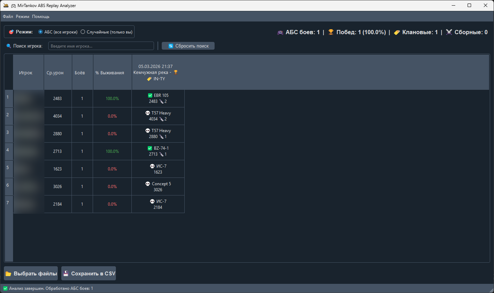
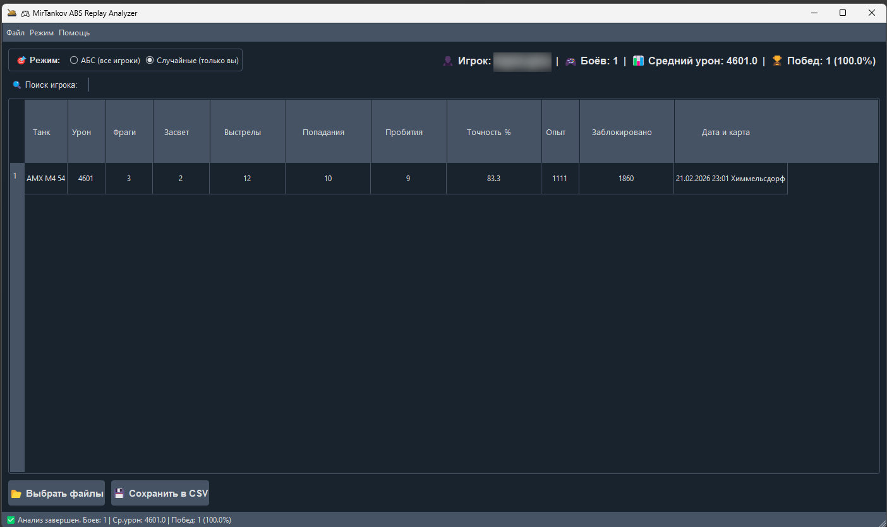
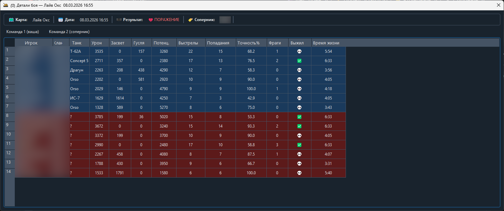

# 🎮 MirTankov ABS Replay Analyzer

[](https://www.python.org/downloads/)
[](https://www.microsoft.com/windows)
[](LICENSE)
[](https://github.com/AleXNocS/MirTankov-ABS-Replay-Analyser/releases/latest)
[](https://github.com/AleXNocS/MirTankov-ABS-Replay-Analyser/releases)

### 👥 Авторы / Authors
[AleXNocS](https://github.com/AleXNocS) – something like developer
Sk0p1 (aka panda_rez) – Inspiration+Motivation 😎 & Tester
[Akatsuki Log Horizon](https://github.com/Akatsuki-Log-Horizon) Tester

---

## 🌟 Возможности / Features

### Русский
- **Прямой парсинг .mtreplay** – без промежуточных файлов
- **Выбор нескольких файлов** через стандартный диалог Windows
- **Два режима работы:**
  - **АБС (7×7)** – матрица статистики всех игроков команды:
    - Средний урон и количество боёв каждого игрока
    - Процент выживания
    - Урон + техника за каждый бой (`-` если игрока не было в бою)
    - Клан соперника и результат (победа/поражение) в заголовке каждого боя
  - **Случайные бои** – детальная статистика только владельца реплеев:
    - Урон, фраги, засвет, выстрелы, попадания, пробития, точность, опыт, заблокировано
- **Окно детального анализа боя** – двойной клик по заголовку боя открывает:
  - Статистику всех 14 игроков (обе команды)
  - Урон, ассист радио, ассист гусля, потенциальный урон, выстрелы, точность, время жизни
  - Команды выделены разными цветами
- **Экспорт в CSV** для анализа в Excel
- **Тёмная тема** интерфейса
- **Готовый `.exe` файл** – не требует установки Python

### English
- **Direct .mtreplay parsing** – no intermediate files needed
- **Multiple file selection** via native Windows file dialog
- **Two analysis modes:**
  - **ABS (7×7)** – player statistics matrix for the whole team:
    - Average damage and battle count per player
    - Survival rate percentage
    - Damage + vehicle per battle (`-` for missed battles)
    - Opponent clan tag and win/loss result in each battle header
  - **Random battles** – detailed stats for the replay owner only:
    - Damage, frags, spotting, shots, hits, piercings, accuracy, XP, blocked damage
- **Battle detail window** – double-click a battle header to open:
  - Full stats for all 14 players (both teams)
  - Damage, radio assist, track assist, potential damage, shots, accuracy, lifetime
  - Teams highlighted in different colors
- **Export to CSV** for further analysis in Excel
- **Dark theme** UI
- **Standalone `.exe`** – no Python installation required

---

## 📦 Быстрый старт / Quick Start

### 🏃 **Для пользователей / For users**

#### Русский
1. **Скачайте готовую программу:**
   - Перейдите на страницу [Releases](https://github.com/AleXNocS/MirTankov-ABS-Replay-Analyser/releases/latest)
   - Скачайте `MirTankov_ABS_Analyzer.exe`
   - Запустите файл – **Python не требуется!**

2. **Как использовать:**
   - Запустите `.exe` файл
   - Выберите режим: **АБС** или **Случайные**
   - Укажите ваши `.mtreplay` файлы
   - Просмотрите результаты в таблице
   - Двойной клик по заголовку боя – детальная статистика всех 14 игроков
   - Нажмите "Сохранить в CSV" для экспорта данных

#### English
1. **Download the ready-to-use executable:**
   - Go to [Releases](https://github.com/AleXNocS/MirTankov-ABS-Replay-Analyser/releases) page
   - Download `MirTankov_ABS_Analyzer.exe`
   - Run it directly – **no Python installation required!**

2. **How to use:**
   - Launch the `.exe` file
   - Select mode: **ABS** or **Random**
   - Choose your `.mtreplay` files
   - View results in the table
   - Double-click a battle header to open detailed stats for all 14 players
   - Click "Сохранить в CSV" (Save to CSV) to export data

---

## Примеры
### Анализ АСБ 🏆

### Анализ Рандома 🎲

### Окно детального анализа боя

---

## 🐍 **Для разработчиков / For developers**

### English

If you want to run from source code or modify the tool:

#### Clone the repository
```bash
git clone https://github.com/AleXNocS/MirTankov-ABS-Replay-Analyser.git
cd MirTankov-ABS-Replay-Analyser
```

#### Install dependencies
```bash
pip install -r bin/requirements.txt
```

#### Run from source
```bash
python bin/main.py
```

#### Create your own executable
```bash
cd bin
pyinstaller MirTankov_ABS_Analyzer.spec
# The .exe file will appear in the 'dist' folder
```

---

### Русский

Если вы хотите запустить из исходного кода или модифицировать инструмент:

#### Клонируйте репозиторий
```bash
git clone https://github.com/AleXNocS/MirTankov-ABS-Replay-Analyser.git
cd MirTankov-ABS-Replay-Analyser
```

#### Установите зависимости
```bash
pip install -r bin/requirements.txt
```

#### Запуск из исходного кода
```bash
python bin/main.py
```

#### Создание исполняемого файла
```bash
cd bin
pyinstaller MirTankov_ABS_Analyzer.spec
# Готовый .exe файл появится в папке 'dist'
```

---

## 📁 Структура проекта / Project Structure

```
MirTankov-ABS-Replay-Analyser/
│
├── bin/                            # Исходный код / Source code
│   ├── main.py                     # Точка входа / Entry point
│   ├── icon.ico                    # Иконка приложения / App icon
│   ├── MirTankov_ABS_Analyzer.spec # Спецификация PyInstaller
│   ├── requirements.txt            # Зависимости / Dependencies
│   ├── parse_all_short_names.py    # Парсер названий танков / Tank name parser
│   │
│   ├── gui/                        # GUI компоненты / GUI components
│   │   ├── __init__.py
│   │   ├── main_window.py          # Главное окно / Main window
│   │   └── battle_detail.py        # Окно детального анализа боя / Battle detail window
│   │
│   ├── models/                     # Модели данных / Data models
│   │   ├── __init__.py
│   │   ├── analyzer.py             # Анализатор АБС / ABS analyzer
│   │   ├── analyzer_random.py      # Анализатор рандома / Random battle analyzer
│   │   ├── battle_detail_extractor.py  # Экстрактор детальных данных / Detail data extractor
│   │   └── tank_short_names.json   # Словарь названий танков / Tank name dictionary
│   │
│   └── utils/                      # Утилиты / Utilities
│       ├── __init__.py
│       ├── clan_extractor.py       # Извлечение данных о кланах / Clan data extractor
│       └── file_dialog.py          # Диалог выбора файлов / File selection dialog
│
├── images/
│   └── ReadME_images/
│       ├── abs_results_example_1.png
│       └── random_results_example_1.png
│
├── CODE_OF_CONDUCT.md
├── CONTRIBUTING.md
├── LICENSE
├── PULL_REQUEST_TEMPLATE.md
├── SECURITY.md
└── README.md
```

---

## 🛠️ Требования / Requirements

**For .exe version / Для .exe версии**
Windows 7/8/10/11
No Python required – just download and run!

**For source code / Для исходного кода**
Python 3.8+
Windows OS

Key dependencies (see `bin/requirements.txt` for full list):
- `PyQt6` – UI framework
- `QDarkStyle` – dark theme
- `wotreplay` – replay data extraction
- `PyInstaller` – for building the .exe

---

### 📝 Примечания / Notes

This tool is designed for the Lesta Games version of World of Tanks (`.mtreplay` files)
All processing is done locally – no data is sent anywhere
The `.exe` version is completely standalone and portable

Инструмент предназначен для версии Lesta Games Мира танков (файлы `.mtreplay`)
Вся обработка происходит локально – данные никуда не отправляются
`.exe` версия полностью автономна и портативна

---

## 🤝 Участие в разработке / Contributing

### Contributions are welcome! Feel free to:
- Report bugs
- Suggest new features
- Submit pull requests

### Приветствуется любой вклад! Вы можете:
- Сообщать об ошибках
- Предлагать новые функции
- Отправлять pull request'ы

---

### 📄 Лицензия / License
This project is licensed under the MIT License – see the LICENSE file for details.
Этот проект лицензирован под MIT License – подробности в файле LICENSE.

---

### 🙏 Благодарности / Acknowledgements
Thanks to the World of Tanks/Mir Tankov community
Inspired by various replay parsing tools
Спасибо сообществу Мира танков
Вдохновлено различными инструментами для парсинга реплеев
**Отдельно спасибо владельцу сайта wn8.pro который вырезал RU регион без указания причины.**

---

### 🚀 Скачивайте и анализируйте свои бои!
### 🚀 Download now and analyze your battles!
